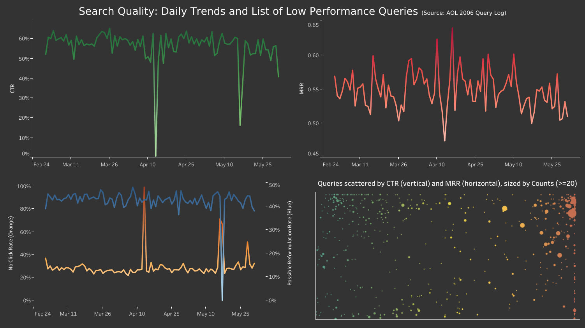

# Project 1: Query Log Relevance Detective (AOL-IA demo)

## Goal
Use query logs + click signals to surface search pain points, quantify impact, and outline practical fixes.

## Dataset
- Source: AOL-IA query logs via `ir_datasets` (sample: 200,000 search events)
- Storage: DuckDB at `data/local.duckdb`
- Scope note: AOL-IA provides search events and clicked items. It does not provide full impression lists (all results shown), so metrics use click-based proxies.

## Tables
- `search_events`: one row per search event (keyed by `event_id`)
- `click_events`: one row per clicked item (multiple rows can map to the same `event_id`)
- `search_events_sess`: searches sessionized by 30-min inactivity gap per user

## Metrics (proxies)
- **CTR (proxy):** `avg(has_click)` where `has_click ∈ {0,1}` per search event  
- **MRR:** `avg(1 / best_click_rank)` using the best (minimum) clicked rank per event
- **No-click session rate:** share of sessions with zero clicks
- **Possible reformulation rate:** share of sessions with >1 distinct query (proxy, not a perfect reformulation definition)

## Outputs
- `outputs/daily_kpis.csv` (daily CTR/MRR/no-click/reformulation proxies)
- `outputs/top_bad_queries.csv` (high-volume queries ranked by lowest CTR)

## Dashboard (click to interact at Tableau Public)
- [](https://public.tableau.com/views/demo_17666438544170/Dashboard1?:language=en-US&:sid=&:redirect=auth&:display_count=n&:origin=viz_share_link)

This dashboard summarizes search quality using **click-based proxies** from the AOL-IA query log sample (200k search events).  
Note: the dataset includes clicks (rank of clicked items), but does **not** include full impression lists (all results shown), so metrics are computed from click signals.

### Daily trend metrics (top charts)
- **CTR (proxy)**  
  For each search event, `has_click = 1` if any click occurred for that search, else `0`.  
  **CTR = avg(has_click)** per day.  
  Interpretation: “share of searches that produced at least one click.” Higher is better.

- **MRR (Mean Reciprocal Rank)**  
  For each search event, compute `best_click_rank = min(clicked rank)` (if any click).  
  `rr = 1 / best_click_rank` (if clicked), else NULL.  
  **MRR = avg(rr)** per day.  
  Interpretation: rewards clicks near the top. Higher is better (1.0 means best-click rank = 1 on average).

### Daily Session Level Trends (bottom left)
- **No Click Rate**  
  Sessions are defined per user as sequences of searches separated by **≤ 30 minutes** gap.  
  A session is “no-click” if it contains **zero clicks** across all its search events.  
  **No Click Rate = share of sessions with zero clicks** per day. Lower is better.

- **Possible Reformulation Rate (proxy)**  
  A session is flagged as “possible reformulation” if it contains **> 1 distinct `query_norm`**.  
  **Possible Reformulation Rate = share of sessions flagged** per day.  
  Interpretation: rough proxy for users re-trying queries; lower is generally better.  
  (Caveat: multiple distinct queries can also reflect multi-intent browsing, not only reformulation.)

### Query Plot (bottom right)
- Shows **high-volume queries** (default: `q_count >= 20`) scattered by the following metrics:
  - `Count (size)`: number of occurrences of the normalized query in the sample
  - `CTR (vertical axis)`: avg(has_click) for that query
  - `MRR (horizontal axis, color)`: avg(rr) for that query (NULL if no clicks recorded)

## Limitations
- CTR is a click-presence proxy (no impression lists), so it should be interpreted as “% of searches with any click,” not clicks/impressions.
- Sessionization uses a simple 30-minute inactivity rule; multi-intent browsing can be misinterpreted as “reformulation.”

## Findings
- CTR and MRR drop sharply on **2006-04-13** (day-level anomaly).
- No-click session rate is strongly negatively correlated with CTR in this sample because most 30-minute sessions contain a single search (so session-level “no click” approximates 1 − CTR).

## Recommendations (mock)
- Validate instrumentation on **2006-04-13**:
  - compare click-event volume vs search-event volume by hour,
  - check whether clicked ranks/doc_ids are missing or malformed that day.
- Segment the anomaly:
  - identify which query clusters (navigational/URL-like vs entity queries) account for most of the CTR/MRR drop.
- If the issue is logging/instrumentation, backfill or correct the pipeline and re-run the daily KPIs; if it’s behavioral/query-mix, create a query-classifier and monitor mix shifts over time.

## How to run
```bash
uv run python projects/01_query_log_relevance_detective/scripts/etl_aol_ia.py --limit 200000
uv run python projects/01_query_log_relevance_detective/scripts/build_metrics.py
```
